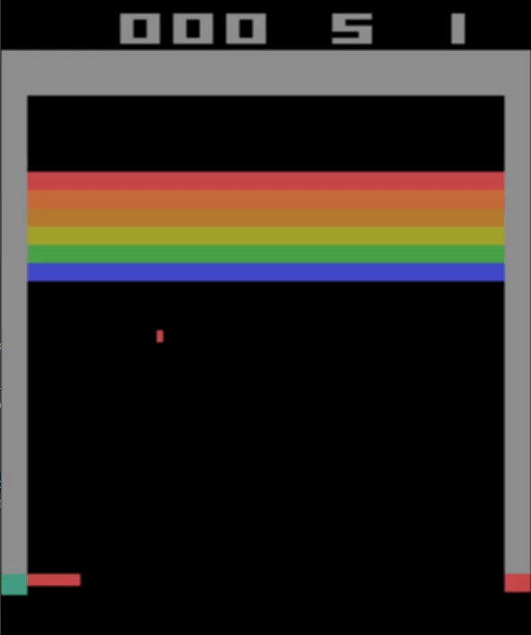

# Deep RL

Minimal pytorch framework for developing Deep Reinforcement Learning algorithms.



### Features

* Simple and flexible replay buffer
* Wrappers to drive gym environment and store transitions
* Supports on-policy and off-policy
* Visualizes statistics during agent runs on environment
* Extensible replay buffer, supports data enrichment using gym type interface
* All core functions in a single file, just drag and drop into your project

[Docs](https://duanenielsen.github.io/deep_rl/)

### Installing

```commandline
sudo apt install swig ffmpeg python3-dev libglew-dev patchelf libosmesa6-dev libgl1-mesa-glx libglfw3
```

install the requirements in requirements.txt using pip3

install mujoco 210

```commandline
cd ~/Downloads
wget https://mujoco.org/download/mujoco210-linux-x86_64.tar.gz
cd ~
mkdir .mujoco
cd mujoco
tar xvf ~/Downloads/mujoco210-linux-x86_64.tar.gz
```

The following environment variables must be set in bashrc and in pycharm for mujoco_py to work
```commandline
export LD_PRELOAD=/usr/lib/x86_64-linux-gnu/libGLEW.so
export LD_LIBRARY_PATH=$LD_LIBRARY_PATH:/home/duane/.mujoco/mujoco210/bin:/usr/lib/nvidia
```

install d4rl using it's documentation

## Workarounds

dr4l doesn't seem to play well on ubuntu 20.04, you may encounter this error

RuntimeError: Failed to initialize OpenGL

in the file venv/lib/python3.10/site-packages/gym/envs/mujoco/mujoco_env.py

change
```
            elif mode == "rgb_array" or mode == "depth_array":
                self.viewer = mujoco_py.MjRenderContextOffscreen(self.sim, -1)
```
to
```
            elif mode == "rgb_array" or mode == "depth_array":
                self.viewer = mujoco_py.MjRenderContextOffscreen(self.sim, 0)
```

## Replay buffer

Replay buffer is implemented as a gym wrapper

```python
import gym
import buffer as bf

env = gym.make('CartPole-v1')
env, replay_buffer = bf.wrap(env, plot=True, plot_blocksize=8)
```

Step the environment one step at a time using a generator

```python
import driver

for transition in driver.step_environment(env, policy):
    continue
```

or collect an episode

```python
import driver

driver.episode(env, policy)
```

sample an off-policy batch from the replay buffer

```python
from buffer import ReplayBufferDataset
from torch.utils.data import DataLoader, SubsetRandomSampler
import random

batch_size = 8
ds = ReplayBufferDataset(buffer)
sampler = SubsetRandomSampler(random.sample(range(len(ds)), batch_size))
dl = DataLoader(buffer, batch_size=batch_size, sampler=sampler)
```

sample an on-policy batch

```python
from buffer import ReplayBufferDataset
from torch.utils.data import DataLoader

ds = ReplayBufferDataset(buffer)
dl = DataLoader(ds, batch_size=10000, num_workers=0)
```

## Enrichment and ReplayBufferDataset

You can load only the parts of a transition you want

Specify a subset of the transition using the below keys

term
- s - state at t0
- a - action
- s_p - state at t1
- r - reward
- d - done

only fetch state at t0 and action from the buffer

```python
import buffer as bf

ds = bf.ReplayBufferDataset(buffer, fields=('s', 'a'))

>>> ds[0]
Transition(s=array([ 0.01236617,  0.04175304, ...]), 
           a=0
           )
```

You can also enrich the information collected in the buffer by implementing an Enricher or using a provided enricher

enrichment is added to the transition info dict

use the info_keys attribute on ReplayBufferDataset to add the key to the transition

```python
import gym
import buffer as bf

env = gym.make('CartPole-v1')
env, replay_buffer = bf.wrap(env, plot=True, plot_blocksize=8)
replay_buffer.enrich(bf.DiscountedReturns(key='g', ))

ds = bf.ReplayBufferDataset(replay_buffer, info_keys=['g'])

>>> ds[0]
Transition(s=array([0.01236617, 0.04175304, ...]),
           a=0,
           s_p=array([0.01320123, -0.15324907, ...]),
           r=1.0,
           d=False,
           g=8.02526121523242)

```